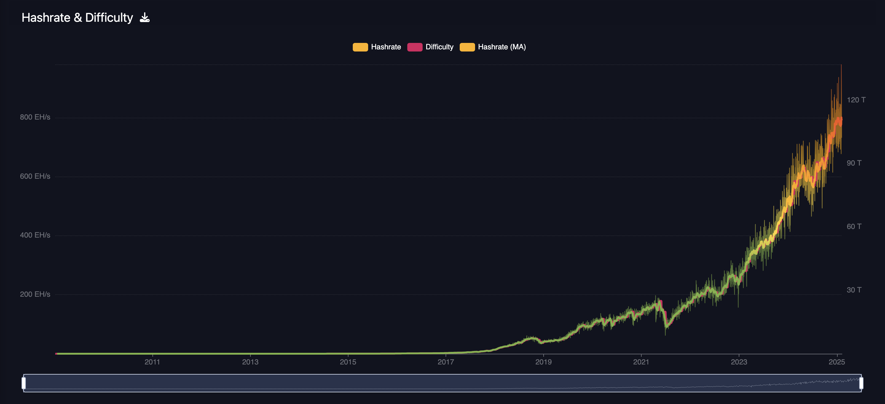
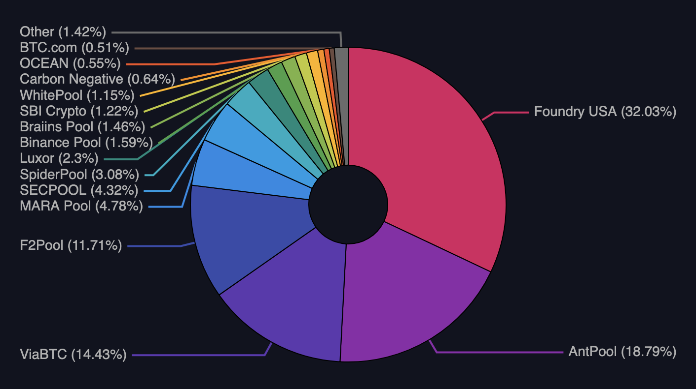

# A step towards mining decentralization.

---

# Stratum V2: the new mining protocol

A mining protocol defines a set of communication rules between mining devices, proxies & pool servers, to contribute hashrate to the bitcoin network.

---

# Hashrate growth

---

---

# Mining pools transactions selection

---

# 🚨 DEFCON 🚨

---

---

To check it in real-time: https://mempool.space/stratum

---

# 🚨 BLOCKSPACE MONOPOLIZATION 🚨

---

---

# SV2 is not a silver bullet

- FPPS is still a cancer.
- Bitmain is still turning into a behemoth.
- AT LEAST they shouldn't be able to monopolize blockspace.

---

## Stratum V2: Specs

Can be read at `stratumprotocol.org/specification`

Can be improved at `github.com/stratum-mining/sv2-spec`

---

## Stratum Reference Implementation (SRI)

Since 2020, a group of independent developers started to work on a fully open-source implementation of Stratum V2, called SRI (Stratum Reference Implementation).

The purpose of SRI group is to build, beginning from the SV2 specs, a community-based implementation, while discussing and cooperating with as many people of the Bitcoin community as possible.

The Rust codebase can be found at `github.com/stratum-mining/stratum`

---

## SRI: Possible Configurations

Thanks to all these different roles and sub-protocols, SV2 can be used in many different mining contexts.

The SRI working group defined 4 main possible configurations which can be the most probable real use-cases, and they are defined as the following listed.

---

# Config A

---

# Config B

---

# Config C

---

# Config D

---

 
# Q&A

---

# Thank you
