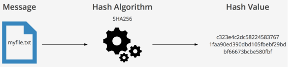
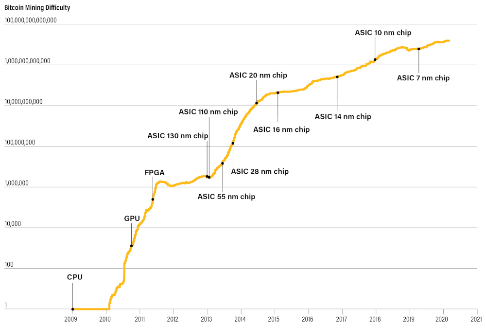
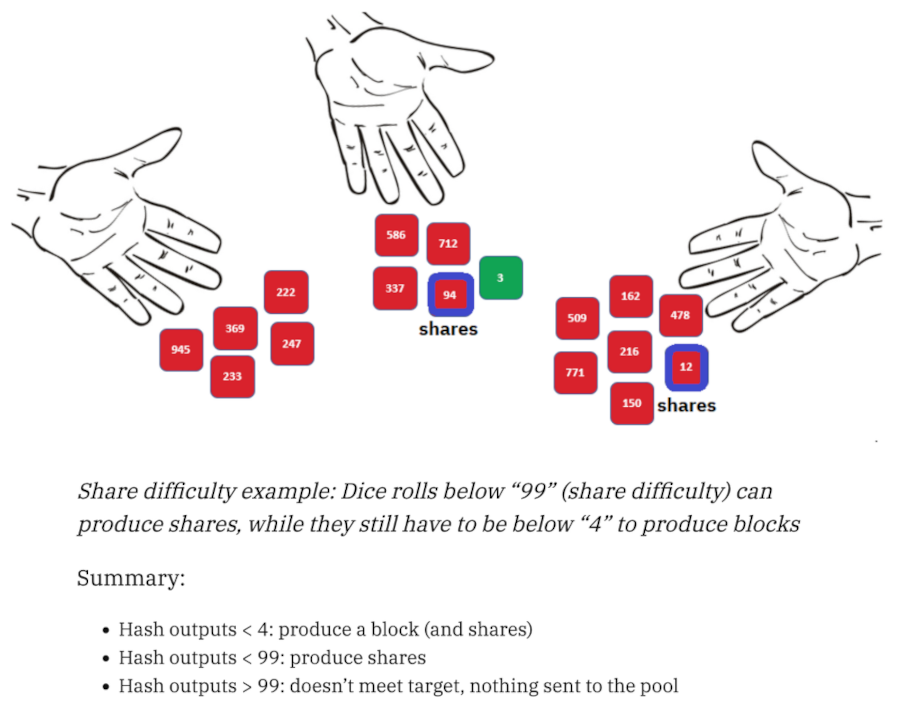
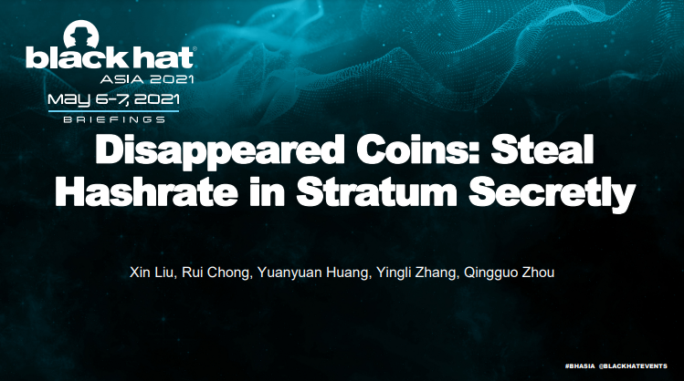

# Mineração de Bitcoin na prática com Stratum V2

<!-- _class: credit -->
por [`@plebhash`](https://plebhash.github.io)

---

 
Este workshop é uma versão resumida da série StratumV2 Explained (em inglês).

---

# Agenda

- conceitos de mineração
- história da mineração
- limitações do SV1
- implementação referência SV2
- mão na massa

---

# Conceitos de Mineração

---

## Função Hash

Função matemática que recebe uma entrada de qualquer tamanho (preimagem) e produz um número (hash, ou digest) enquanto segue as seguintes propriedades:

- Determinismo
- Saída de tamanho fixo (em bits)
- Resistência de preimagem
- Resistência de colisão

Apesar do hash ser um número binário, ele é comumente representado como uma string de caracteres para melhor visualização humana.

---

## Função Hash

---

## Função Hash

O Bitcoin usa a função hash chamada `SHA256`, definida sob o padrão [`FIPS PUB 180-4`](https://nvlpubs.nist.gov/nistpubs/FIPS/NIST.FIPS.180-4.pdf) do National Institute of Standards and Technology.

---

## Mineração no Bitcoin

No Bitcoin, a mineração possui dois propósitos:
- Adicionar novas transações na timechain sem a permissão de nenhuma entidade centralizada (e.g.: Banco Central 🏦)
- Possibilitar uma distribuição justa dos 21M BTC e taxas aos mineradores que alocam recursos físicos (energia ⚡) para fornecer segurança à rede.

---

## Mineração no Bitcoin

O **alvo de dificuldade** do Bitcoin representa o maior valor que o hash de um bloco pode assumir, de forma a ser considerado válido na rede.

Mineradores precisam encontrar um cabeçalho de bloco (header) que quando usado como preimagem pro algoritmo `SHA256`, gera um hash que satisfaz o alvo de dificuldade da rede (reajustado a cada 2016 blocos).

---

## Mineração no Bitcoin

Blocos candidatos (templates) são construídos com as melhores transações recebidas via full-nodes (geralmente as transações que pagam mais taxas).

O chamado cabeçalho de bloco (header) inclui os seguintes campos:

- `parent block hash`: hash do bloco anterior na timechain.
- `version`: 4 bytes indicando a versão do protocolo Bitcoin sendo usada durante a geração do bloco.
- `timestamp`: 4 bytes registrando a [unix timestamp](https://www.unixtimestamp.com/) do momento em que o bloco foi minerado.
- `difficulty target`: 4 bytes representando o máximo valor permitido para hash do bloco.
- `merkle root`: hash calculado a partir de todas as transações incluidas no bloco.
- `nonce`: 32-bit que mineradores ajustam de forma a encontrar um hash válido.

---

---

## Mineração no Bitcoin

Para determinado template de bloco, o minerador repetidamente muda o valor do `nonce` e aplica o algoritmo `SHA256` (2x) no cabeçalho até que o hash seja menor que o alvo de dificuldade.

Se o alvo de dificuldade for satisfeito, o minerador adiciona o bloco ao seu registro local da timechain e imediatamente propaga o bloco aos seus pares.

Essa propagação precisa acontecer o mais rápido possível, uma vez que isso é crucial para que o minerador possa colher o prêmio da mineração.

---

## Mineração no Bitcoin

O prêmio da mineração consiste de:
- Novos BTC criados
- Taxas de transação

O prêmio encontra-se em uma transação especial chamada `coinbase`.

---

## Taxa de Hashes (Hashrate)

A velocidade em que um minerador gera diferentes hashes de blocos na tentativa de encontrar um bloco válido é chamada de **hashrate**.

---

# História da Mineração

---

## História da Mineração

O primeiro bloco foi minerado por Satoshi Nakamoto em 3 de Janeiro de 2009.

O número total de mineradores era muito pequeno, então a dificuldade não aumentava, e era possível minerar blocos com um computador pessoal mediano. Foi o único período na história em que mineração via CPU era lucrativo.

Assim que a mineração começou a receber mais atenção midiática, a dificuldade começou a aumentar.

---

## História da Mineração

Em Outubro de 2010, o primeiro dispositivo de mineração baseado em Graphic Processing Unit (GPU) foi desenvolvido. A excelência das GPU em computação paralela de operações matemáticas simples causou crescimento do hashrate global da rede, aumentando o alvo de dificuldade.

Em 2011, as Field Programmable Gate Arrays (FPGA) entraram em cena. Elas eram mais rápidas que as GPUs, contribuindo ainda mais para o aumento do hashrate global e do alvo de dificuldade da rede.

---

## História da mineração

Em 2013 a empresa chinesa chamada Canaan Creative introduziu o primeiro Application Specific Integrated Circuit (ASIC) de mineração.

Logo outras empresas como Bitmain e MicroBT também entraram em cena introduzindo seus próprios modelos de ASIC.

Em contraste com as CPUs, GPUs e FPGAs, que são dispositivos de propósito geral, os dispositivos ASIC são projetados com o propósito exclusivo de mineração de Bitcoin.

---

## História da mineração

A evolução nos projetos ASIC é baseada na redução consistente de tamanho dos transistores, bem como na sua eficiência energética.

A começar com tamanhos de 130nm em 2013, os modelos mais recentes possuem tamanhos tão pequenos quanto 5nm.

Atualmente, estima-se que um ASIC é 100 bilhões de vezes mais eficiente que uma CPU mediana de 2009.

---

---

---

## História da mineração
### Mineração Solo

Na mineração solo, o minerador depende unicamente de seu próprio poder computacional para competir com o resto da rede na corrida para encontrar o próximo bloco.

O endereço do minerador solo é adicionado ao coinbase, e prêmio do bloco é pago de forma integral para esse minerador.

---

## História da mineração
### Mineração Solo
<!-- 
footer: Fonte: Meni Rosenfeld. Analysis of bitcoin pooled mining reward systems. arXiv preprint arXiv:1112.4980, 2011.
 -->

O alvo de dificuldade $D$ é escolhido tal que cada hash computado leva a um bloco válido com probabilidade $\frac{1}{2^{32}D}$.

Um minerador com hashrate $h$ minerando por um período de tempo $t$ vai calcular um total de $ht$ hashes, e portanto encontrará em média $\frac{ht}{2^{32}D}$ blocos.

Se o prêmio para cada bloco é $B$, o prêmio médio esperado para o minerador é $\frac{htB}{2^{32}D}$.

---

## História da mineração
### Mineração Solo: Exemplo

O poder computacional de Bob o permite calcular um bilhão de hashes por segundo: $h = 1 \textrm{Ghash/s} = 10^9 \textrm{hash/s}$.

Se Bob minera continuamente por um dia (86400 segundos), quando o alvo de dificuldade é $D = 1690906$ e o prêmio é $B = 50 \textrm{BTC}$, ele vai encontrar em média $\frac{ht}{2^{32}D} = \frac{10^9\textrm{hash/s·86400s}}{2^{32} \cdot 1690906} \approx 0.0119$ blocos nesse dia, e receber um prêmio médio de $0.0119B = 0.595$.

---

## História da mineração
### Processos Poisson

Um [processo Poisson](https://en.wikipedia.org/wiki/Poisson_point_process) é um modelo matemático usado para modelar eventos aleatórios usando a [distribuição de Poisson](https://en.wikipedia.org/wiki/Poisson_distribution).

O processo Poisson é usado para modelar a probabilidade de um número específico de eventos ocorrerem em um intervalo de tempo específico.

Possui as seguintes propriedades:

- O número de eventos em intervalos de tempo disjuntos são independentes.
- A taxa de eventos é constante.
- O tempo entre eventos segue uma distribuição exponencial.
- A probabilidade de um evento ocorrer no futuro é independente do passado (*Memoryless*).
- A média é igual à variância.

---

## História da mineração
### Mineração Solo: Variância

Encontrar um bloco em mineração solo é um Processo de Poisson com $\frac{h}{2^{32}D}$ como parâmetro (também chamado de taxa média).

Minerar por um tempo $t$ resulta em $\frac{ht}{2^{32}D}$ blocos encontrados em média, tal que o número de blocos minerados segue uma distribuição de Poisson com $λ=\frac{ht}{2^{32}D}$, onde esse valor representa a variância do número de blocos encontrados.

Então a variância do prêmio é $λB^2=\frac{htB^2}{2^{32}D}$, e o desvio padrão relativo (como uma fração do prêmio esperado) é $\frac{\sqrt{λB^2}}{λB} = \frac{1}{\sqrt{λ}} = \sqrt{\frac{2^{32}D}{ht}}$.

---

## História da mineração
### Mineração Solo: Exemplo de Variância

Bob (do exemplo anterior) possui variância de $0.0119B^2 = 29.75 \textrm{BTC}^2$ em seu prêmio. O desvio padrão é $\sqrt{29.75\textrm{BTC}} ≈ 5.454 \textrm{BTC}$, que corresponde a $917$% da expectativa.

A probabilidade de que Bob vai receber **QUALQUER PRÊMIO** pelo seu dia de trabalho é $1 − e^{−λ} ≈ 1.18$%.

Como Bob pode criar um modelo de negócio sustentável baseado em uma chance de 1% de lucro?

---

<!-- 
footer: ""
 -->

## História da mineração
### Mineração em Pool

Conforme o hashrate global cresceu, a mineração se tornou uma atividade de escala industrial.

Mineradores passaram a considerar diversos fatores para o seu modelo de negócio, tal como a variância proibitiva de mineração solo.

Assim, o conceito de mineração em pool se popularizou como uma solução para esse problema.

---

## História da mineração
### Mineração em Pool

Pools são sistemas onde múltiplos mineradores combinam seu poder computacional e compartilham os prêmios da mineração.

Em pools custodiais (maioria dos casos atuais), o template é construído de forma que o prêmio vai para um endereço controlado pela pool.

Mineradores individuais conectam seus equipamentos ao servidor da pool. Cada minerador comunica seu endereço Bitcoin à pool, que é usado para distribuição de lucros no futuro.

---

## História da mineração
### Mineração em Pool

O modelo de negócio dos operadores de pool geralmente consiste em recolher uma porcentagem dos prêmios.

---

## História da mineração
### Shares

A pool contabiliza o trabalho feito por cada minerador individual via **shares**, que são blocos cujo hash foi minerado sob um alvo de dificuldade menor do que aquele da rede.

---

---

## História da mineração
### Shares

Quando algum minerador encontra um bloco válido, o prêmio é recolhido pela pool. Todos mineradores conectados a essa pool tem direito a requisitar que a pool faça uma transação enviando um valor em BTC proporcional ao seu trabalho (contabilizado pelo número de shares enviadas).

---

## História da mineração

A primeira pool foi criada em 2010, chamada **Slushpool** (atualmente conhecida como **Braiins**).

Desde então, outras pools foram criadas.

De forma a coordenar a comunicação entre mineradores e pool, algum tipo de protocolo especializado para mineração em pool precisava ser desenvolvido.

---

## História da mineração

- `getwork` foi um método RPC introduzido ao Bitcoin Core em 2010. Rapidamente demonstrou limitações (pequeno espaço de busca).
- `getblocktemplate` foi introduzido em 2012 por Luke-Jr via `BIP22` and `BIP23`.
- Também em 2012, o fundador da Slushpool chamado Marek "Slush" anunciou o protocolo chamado Stratum.

A performance do Stratum era melhor que o RPC `getblocktemplate`, e assim o protocolo acabou tornando-se o padrão de indústria para mineração em pools.

---

## História da mineração
### Stratum

Assim como `getblocktemplate`, o protocolo Stratum visava resolver a principal limitação do `getwork`:

Os equiamentos de mineração eram capazes de varrer o espaço de busca (32 bits do `nonce`) muito rapidamente, acarretando em frequentes pedidos de trabalho e congestão de rede para a pool.

O protocolo Stratum introduziu um campo `extranonce` como uma parte mutável da transação `coinbase`, expandindo assim o espaço de busca.

---

## Limitações do Stratum V1

No Stratum V1, a comunicação entre minerador e pool acontece sem criptografia.

Em 2021, [(Liu X. et al.)](https://i.blackhat.com/asia-21/Thursday-Handouts/as-21-Liu-Disappeared-Coins-Steal-Hashrate-In-Stratum-Secretly.pdf) demonstraram a viabilidade de um ataque Man-In-The-Middle onde o atacante rouba hashrate do minerador de forma praticamente indetectável.

---

## Limitações do Stratum V1

A falta de criptografia na conexão entre minerador e pool também implica em questões de privacidade, onde a atividade do minerador pode ser monitorada por agentes externos.

---

## Limitações do Stratum V1

No StratumV1, a comunicação entre minerador e pool acontece via `JSON-RPC` sobre `HTTP`. Isso acarreta em uso ineficiente de recursos de rede.

---

## Limitações do Stratum V1

Por fim, no Stratum V1, a pool possui poder unilateral de escolha de quais transações entrarão no bloco a ser minerado.

Isso resulta em centralização e censura em potencial.

---

## Stratum V2

De forma a mitigar as limitações do SV1, SV2 foi proposto em 2019 por Pavel Moravec e Jan Čapek (Braiins), em colaboração com Matt Corallo e outros especialistas da área.

 

---

## Stratum V2: Arquitetura

### Roles (Papéis, Funções, Cargos)

Os roles estão envolvidos no fluxo de dados e podem ser classificados como downstream ou upstream nas relações entre si.

---

## Stratum V2: Arquitetura

### Roles: Dispositivo de Mineração

Um dispositivo de mineração é o ASIC que performa os cálculos de hashes.

É considerado o role mais downstream.

---

## Stratum V2: Arquitetura

### Roles: Pool

Este role pertence à entidade para onde o hashrate produzido pelos dispositivos de mineração é consumido.

É considerado o role mais upstream.

---

## Stratum V2: Arquitetura

### Roles: Proxy

Este role representa um servidor proxy responsável por coordenar e agregar as mensagens entre o dispositivo de mineração e o serviço da pool.

É upstream com relação ao dispositivo de mineração, e downstream com relação à pool.

---

## Stratum V2: Arquitetura

### Roles: Provedor de Template (TP)

Cliente (ou nó) Bitcoin Core que é responsável por gerar templates customizados.

Esses templates são enviados ao declarador de Jobs (a seguir).

---

## Stratum V2: Arquitetura

### Roles: Declarador de Jobs (Job Declarator)

Esses roles são divididos entre o lado da pool (servidor) e o lado do minerador (cliente), mas também podem ser gerenciados por terceiros.

Eles se conectam com o Provedor de Template, de forma a receber e validar templates.

Juntos, eles estabelecem o **Protocolo de Declaração de Jobs** como um processo de negociação entre minerador e pool.

Os jobs são enviados aos Proxies através do **Protocolo de Distribuição de Jobs**.

---

## Stratum V2: Arquitetura

### Roles: Job Declarator Server (JDS)

O Job Declarator Server é um role no lado da pool, responsável por alocar tokens de jobs necessários para que o Job Declarator Client possa criar jobs customizados para trabalhar.

Também é a entidade reponsável pela propagação de blocos válidos em nome da pool.

---

## Stratum V2: Arquitetura

### Roles: Job Declarator Client (JDC)

O Job Declarator Client é um role no lado do minerador, responsável por criar novos jobs de mineração dos templates recebidos do TP ao qual está conectado.

Ele declara os jobs customizados ao JDS, de forma a negociar o template utilizado e garantir que as shares de mineração serão contabilizadas corretamente.

---

## Stratum Reference Implementation

Os conceitos apresentados nos slides anteriores constituem a especificação do protocolo Stratum V2.

Stratum Reference Implementation (SRI) é um projeto open-source onde as especificações são implementadas na linguagem Rust.

---

## Stratum Reference Implementation

O time foi formado em 2020, e é composto por contribuidores independentes financiados por grants individuais.

O projeto é apoiado por diversas empresas envolvidas em operações de mineração, tais como Braiins, Foundry e Galaxy Digital.

Além disso, outras entidades também estão envolvidas, tais como: Bitmex, Human Rights Foundation, Spiral e OpenSats.