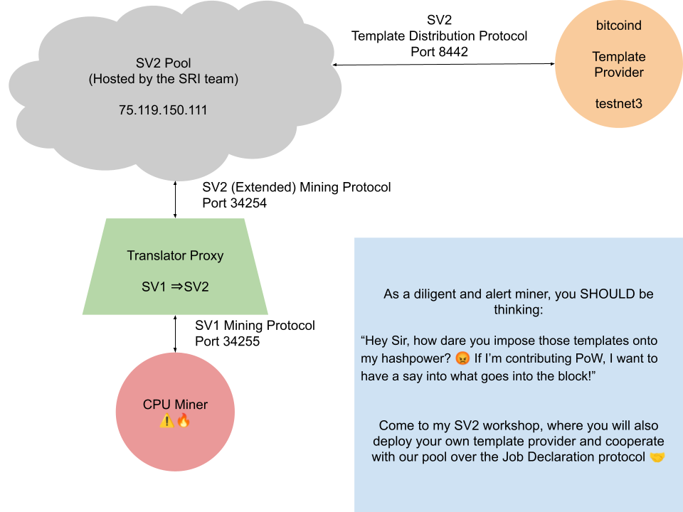
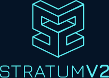
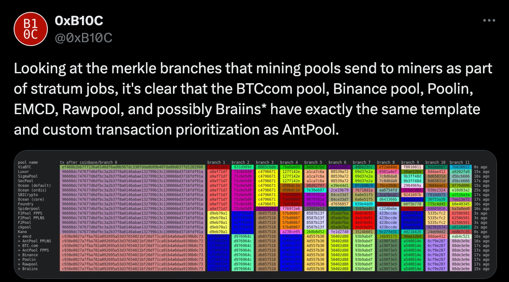
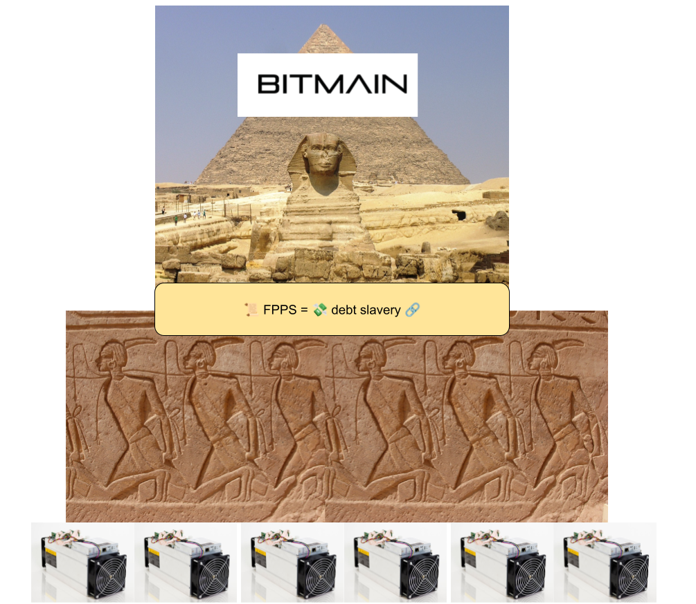
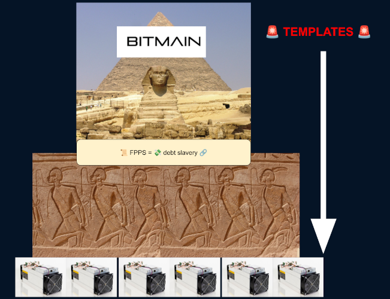
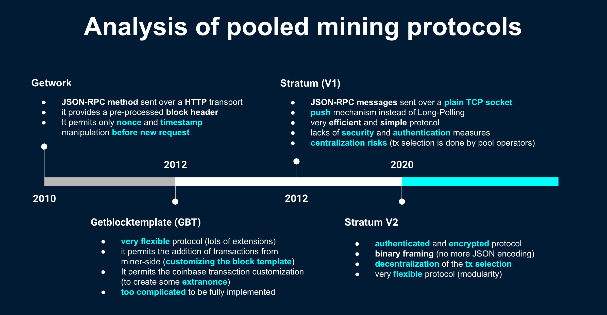
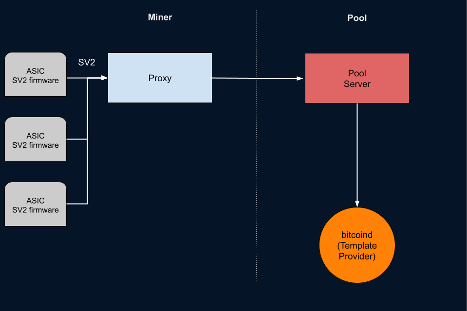
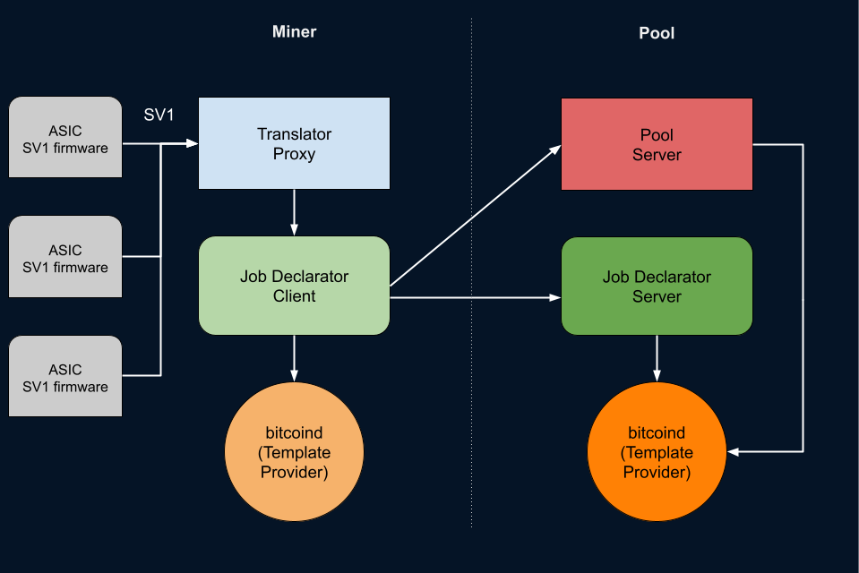
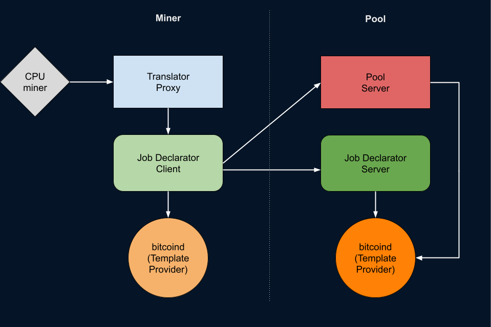

Wanna CPUmine tBTC on our Pool?
```
$ # clone StratumV2 Reference Implementation (SRI)
$ git clone https://github.com/stratum-mining/stratum
$ cd stratum
$ # check out the `btcpp-workshop` branch
$ git checkout btcpp-workshop
$ # 🐇
$ nix-shell
```




---



# SV2 explained: a step towards mining decentralization

<!-- _class: credit -->
by [`@plebhash`](https://plebhash.github.io)


Thanks to Spiral for the grant!

---

Slides available at:
- `github.com/plebhash/sv2-workshop`: markdown source
- `X.X.X.X:8888/html/sv2-workshop.html`: locally served

SSID: `sv2-workshop`
Password: `proofofwork`

---

## Sound the alarm!

🚨🚨🚨<br>
🚨🚨🚨<br>
🚨🚨🚨<br>

---



---



---



---

# 🚨🚨🚨


---


---



---

## Stratum V2: Specs

Can be read at `stratumprotocol.org/specification`

Can be improved at `github.com/stratum-mining/sv2-spec`

---

## SV2 Roles

One of the main conceptual entity in SV2 is the notion of **Roles**.

They are involved in data flow and can be labeled as downstream or upstream in relationship to eachother.

---

## Roles: Mining Device

A Mining Device is the machine responsible for hashing. 

Usually an ASIC + Control Board in most production scenarios, but also a CPU in some testing and development scenarios.

It is the most downstream role.

---

## Roles: Pool

A Pool is where the hashrate produced by Mining Devies is consumed.

It is the most upstream role.

---

## Roles: Proxy

The Proxy acts as an intermediary between the Mining Devices and the Pool.

It receives mining requests from multiple devices, aggregates their hashrate, and forwards them to the SV2 pool.

It can open group/extended channels with upstream (the Pool) and standard channels with downstream (Mining Devices).

---

## Roles: Translator Proxy (tProxy)

The Translator Proxy is responsible for translating the communication between SV1 Mining Devices and an SV2 Pool or Proxy.

It enables legacy SV1-only firmware to interact with SV2-based mining infrastructure, bridging the gap between the older SV1 protocol and SV2.

It can open extended channels with upstream (the Pool or a SV2 Proxy).

---

## Roles: Template Provider (TP)

A custom `bitcoind` node.

Responsible for creation of Block Templates.

---

## Roles: Job Declarator Server (JDS)

Deployed on the Pool infrastructure.

Negotiates Block Templates (on behalf of the Pool) with Job Declarator Clients.

Responsible for allocating the mining job tokens needed by Job Declarator Client to create custom jobs to work on.

---

## Roles: Job Declarator Client (JDC)

Deployed on Miner infrastructure.

Responsible for creating new mining jobs from the templates received by the Template Provider. It negotiates custom jobs with the JDS.

JDC is also responsible for putting in action the Pool-fallback mechanism, automatically switching to backup Pools in case of custom jobs refused by JDS (which is Pool side).

As a solution of last-resort, it is able to switch to Solo Mining until new safe Pools appear in the market.

---

## Stratum Reference Implementation (SRI)

Since 2020, a group of independent developers started to work on a fully open-source implementation of Stratum V2, called SRI (Stratum Reference Implementation).

The purpose of SRI group is to build, beginning from the SV2 specs, a community-based implementation, while discussing and cooperating with as many people of the Bitcoin community as possible.

The Rust codebase can be found at `github.com/stratum-mining/stratum`

---

## SRI: Possible Configurations

Thanks to all these different roles and sub-protocols, SV2 can be used in many different mining contexts.

The SRI working group defined 4 main possible configurations which can be the most probable real use-cases, and they are defined as the following listed.

---

## Config A

Miner runs a JDC, and Pool runs a JDS.

Transactions are chosen by the Miner's Template Provider.

Mining Devices have SV2 compatible firmware, connected to a Proxy.

---

# Config A


---

## Config B

There's no JDC or JDS.

Transactions are chosen by the Pool's Template Provider.

Mining Devices have SV2 compatible firmware, connected to a Proxy.

Similar to a SV1 setup, but still with the benefit from all the security and performance features brought by SV2 into the wire communication.

---

# Config B



---

## Config C

There's no JDC or JDS.

Transactions are chosen by the Pool's Template Provider.

Mining Devices have legacy SV1 compatible firmware, connected to a Translator Proxy.

Similar to a SV1 setup, but still with the benefit from all the security and performance features brought by SV2 into the wire communication.

---

# Config C


---

## Config D

Miner runs a JDC, and Pool runs a JDS.

Transactions are chosen by the Miner's Template Provider.

Mining Devices have legacy SV1 compatible firmware, connected to a Translator Proxy.

---

# Config D



---

# Hands On!

---

Split in pairs. One will be the pool, the other will be the miner.

Connect to this WiFi:
- SSID: `sv2-workshop`
- Password: `proofofwork`

Slides available at `X.X.X.X:8888/html/sv2-workshop.html`

Slide `#24`

---

We will reproduce Configuration D



---

## Custom Signet

Unlike testnet3, signet(s) use the regular difficulty adjustment mechanism. Although the default signet has very low difficulty, you can't mine on it, because to do so requires signing blocks using a private key that only two people have.

We will mine on a custom signet.

Please refer to `X.X.X.X` for a local deployment of `mempool.space` on our workshop WiFi.

---

## Prerequisites

1. Install Rust:
```
curl --proto '=https' --tlsv1.2 -sSf https://sh.rustup.rs | sh
```

---

## Clone SRI

```
git clone https://github.com/stratum-mining/stratum
git checkout btcpp-workshop
```

---


## Get a release from Sjors' Bitcoin Core fork

On Config D, both pool and miner run a Template Provider (`bitcoind`).

We will use `@Sjors`' fork.

Grab a release from https://github.com/Sjors/bitcoin/releases

(known issue on macos: https://github.com/Sjors/bitcoin/issues/40)

---

## Configure Template Provider

Create a workshop datadir for `bitcoind` (Template Provider).

```
mkdir $HOME/.bitcoin-sv2-workshop
```

Use this configuration file to connect to our workshop signet.

```
cat $HOME/.bitcoin-sv2-workshop/bitcoin.conf

[signet]
# OP_TRUE
signetchallenge=51
server=1
connect=<plebhash IP> # plebhash IP
rpcuser=username
rpcpassword=password
```

---

## Start `bitcoind` Template Provider

```
cd bitcoin-sv2
./bitcoin-sv2-tp-0.1.2/bin/bitcoind -datadir=$HOME/.bitcoin-sv2-workshop -signet -sv2 -sv2port=8442
```

---

## Pool-only steps

Miners can jump to slide X

---

## Create wallet (Pool)

```
cd bitcoin
./bitcoin-sv2-tp-0.1.2/bin/bitcoin-cli -signet -datadir=$HOME/.bitcoin-sv2-workshop createwallet sv2-workshop
```

## Generate address (Pool)

```
./bitcoin-sv2-tp-0.1.2/bin/bitcoin-cli -signet -datadir=$HOME/.bitcoin-sv2-workshop getnewaddress sv2-workshop-address
```

---

## Get pubkey (Pool)

```
./bitcoin-sv2-tp-0.1.2/bin/bitcoin-cli -signet -datadir=$HOME/.bitcoin-sv2-workshop getaddressinfo <sv2-workshop-address>
```

Take note of the `pubkey` value so you can use it on the next step, and also to check your mining rewards on mempool later.

---

## Add pubkey to coinbase config (Pool)

Edit `stratum/roles/jd-server/jds-config-btcpp-workshop.toml` to add the `pubkey` from the previous step into `coinbase_outputs.output_script_value`.
<br>

Note: this value also exists in the pool config file. This would be used for a SV1-style setup without Job Declaration Protocol (Config B and C).

Since we are doing our workshop with JD, we only need to modify the JDS config file, and the coinbase will be taken care of during the Job Declaration.

---

### Add a Pool Signature

Edit `stratum/roles/pool/pool-config-btcpp-workshop.toml` to make sure the `pool_signature` has some custom string to identify the pool in the coinbase of the blocks it mines.

Take note of this string because all miners connected to you will need it for their own configs.

---

## Start Job Declarator Server (Pool)

```
cd stratum/roles/jd-server
cargo run -- -c jds-config-btcpp-workshop.toml
```

## Start the Pool Server (Pool)

On a new terminal:
```
cd stratum/roles/pool
cargo run -- -c pool-config-btcpp-workshop.toml
```

---

## Miner-only steps

Pools can skip to slide X

---

## Edit JDC Config (Miner)

Ask for your pool colleague for their IP in the `sv2-workshop` WiFi LAN.

Edit `stratum/roles/jd-client/jdc-config-btcpp-workshop.toml` to make sure:
- `pool_address` and `jd_address` have their IP
- `pool_signature` is identical to what your pool colleague put on their config. Putting the wrong value here will result in your templates being rejected by JDS.

---

## Start Job Declarator Client (Miner)

```
cd stratum/roles/jd-client
cargo run -- -c jdc-config-btcpp-workshop.toml
```

## start Translator Proxy (Miner)

On a new terminal:
```
cd stratum/roles/translator
cargo run -- -c tproxy-config-btcpp-workshop.toml
```

---

## Start CPU mining

Setup the correct CPUMiner for your OS.

- downloadable binaries: `https://sourceforge.net/projects/cpuminer/files/`
- buildable source: `https://github.com/pooler/cpuminer`
- nix: `nix-shell -p cpuminer`

To start mining:

```
minerd -a sha256d -o stratum+tcp://localhost:34255 -q -D -P
```

---

## Explore

Go to out local `mempool.space` explorer: X.X.X.X

Check each block's coinbase.
