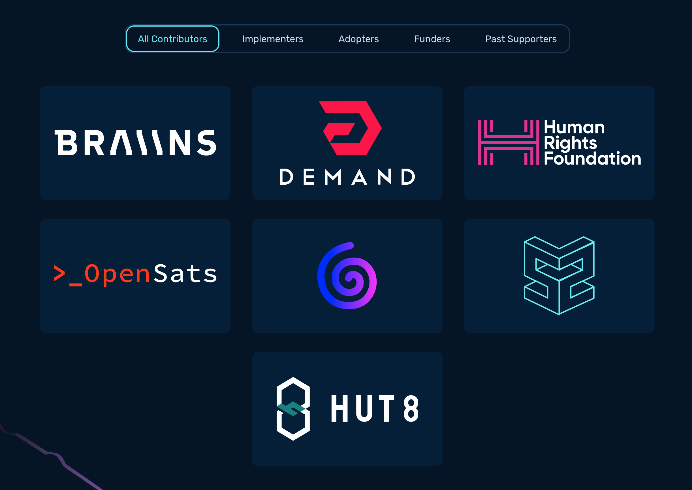

# A step towards mining decentralization.

---

Slides available at

http://75.119.150.111:8888/html/sv2-workshop.html

---

We will be working with the following programs:
1. Rust
2. `bitcoin-core` fork with Sv2 support.
3. `stratum` repo with roles logic.
4. `cpuminer` to act as a hasher (used by the miner role).
5. `tmux` to run multiple processes in the foreground.

These programs are already setup in the `sv2-workshop` Docker image.

---

## Docker Setup
1. Install [Docker](https://docs.docker.com/engine/install/).
2. Configure Docker with the following minimum resource allocations:
    - CPU limit: 4
    - Memory limit: 8GB
    - Swap: 2GB
    - Virtual disk limit: 128 GB
3. Pull the image down:
```sh
docker pull rrybarczyk/sv2-workshop:latest
```
3. Run the image:
```sh
docker run --expose 34264 -p 34264:34264 --expose 34254 -p 34254:34254 --expose 34255 -p 34255:34255 -it --rm --name participant_container rrybarczyk/sv2-workshop:latest
```
---

## Stratum V2: Specs

Can be read at [`stratumprotocol.org/specification`](http://stratumprotocol.org/specification)

Can be improved at [`github.com/stratum-mining/sv2-spec`](http://github.com/stratum-mining/sv2-spec)

---

## SV2 Roles

One of the main conceptual entity in SV2 is the notion of **Roles**.

They are involved in data flow and can be labeled as downstream or upstream in relationship to eachother.

---

## Template Provider (TP)

A custom `bitcoind` node which aims to be merged in Bitcoin Core:
- [PR #29432](https://github.com/bitcoin/bitcoin/pull/29432)
- [PR #29346](https://github.com/bitcoin/bitcoin/pull/29346)

Responsible for creation of Block Templates.

Deployed on both Pool and Miner infrastructure.

---

## Pool

A Pool is where the hashrate produced by Mining Devices is consumed.

It is the most upstream role.

## Job Declarator Server (JDS)

Deployed on the Pool infrastructure.

It receives and manages the custom block templates (on behalf of the Pool) declared by Job Declarator Clients (JDCs).

---

## Job Declarator Client (JDC)

Deployed on Miner infrastructure.

It creates new mining jobs from the templates received by the Template Provider and declares them to the JDS.

It's also able to automatically fallback to backup Pools in case of custom jobs refused by JDS (which is Pool side) or to switch to Solo Mining as a solution of last-resort.

## Translator Proxy (tProxy)

Responsible for translating the communication between SV1 Mining Devices and an SV2 Pool or Proxy.

It enables legacy SV1-only firmware to interact with SV2-based mining infrastructure.

---

## Stratum Reference Implementation (SRI)

Since 2020, a group of independent developers started to work on a fully open-source implementation of Stratum V2, called SRI (Stratum Reference Implementation).

The purpose of SRI group is to build, beginning from the SV2 specs, a community-based implementation, while discussing and cooperating with as many people of the Bitcoin community as possible.

The Rust codebase can be found at [`github.com/stratum-mining/stratum`](http://github.com/stratum-mining/stratum)

---

## Supporters



---

## SRI: Possible Configurations

Thanks to all these different roles and sub-protocols, SV2 can be used in many different mining contexts.

Today we are going to setup the **Config A**, referenced at [`stratumprotocol.org`](http://stratumprotocol.org/)

---

## Config A

Miner runs a **JDC**, and Pool runs a **JDS**.

Transactions are chosen by the **Miner's Template Provider**.

Mining Devices have legacy SV1 compatible firmware, connected to a **Translator Proxy**.

---

# Config A


---

# Hands On!

---

Split in pairs. One will be the pool, the other will be the miner.

Instructions available at http://75.119.150.111:8888/html/sv2-workshop.html

---

## Custom Signet

Which network should we do our workshop?

- `testnet3`? Well, Lopp broke it.
- `signet`? Well, we need the audience to be able to mine blocks.
- `testnet4`? Well, we want a controlled hashrate environment.

We will mine on a custom signet that does not require coinbase signatures. This way, the audience can deploy pools + hashers and emulate a confined hashrate environment.

---

## Connect to Workshop Wifi

Connect to this WiFi:
- SSID: `sv2-workshop`
- Password: `proofofwork`

---

## Docker Terminal
We are using `tmux` to support running multiple processes in the foreground of our Docker image terminal.

Type `tmux` into your terminal to create a new session.

---

## Configure Template Provider

The `bitcoind` datadir is at `$HOME/.bitcoin-sv2-workshop`.

Use this configuration file to connect to our workshop signet:

```sh
nano $HOME/.bitcoin-sv2-workshop/bitcoin.conf
```

```conf
[signet]
# OP_TRUE
signetchallenge=51
server=1
connect=75.119.150.111 # genesis node
rpcuser=username
rpcpassword=password
sv2port=8442
debug=rpc
debug=sv2
loglevel=sv2:debug
```

---

## Start `bitcoind` Template Provider

```sh
bitcoind -datadir=$HOME/.bitcoin-sv2-workshop -signet -sv2
```

---

## Navigate `mempool.space`

There's a local `mempool.space` block explorer available at:

http://<FIX ME>


---

## Pool-only steps

Miners can jump to slide 32.

---

Open a new `tmux` split with `ctrl+b` + `"`. To navigate to the new right pane, click on it. Run all `bitcoin-cli` commands in this split pane.

---

## Create wallet (Pool)

```
bitcoin-cli -signet -datadir=$HOME/.bitcoin-sv2-workshop createwallet sv2-workshop
```

## Generate address (Pool)

```
bitcoin-cli -signet -datadir=$HOME/.bitcoin-sv2-workshop getnewaddress sv2-workshop-address
```

To copy the `address` in `tmux`:
1. Press `ctrl-b` then `[`.
2. Using your arrow keys, navigate to the beginning of the `address`.
3. Press `space`.
4. Use arrow keys to highlight the entire `address`. Press `Enter` to complete the copy.

---

## Get pubkey (Pool)

```
bitcoin-cli -signet -datadir=$HOME/.bitcoin-sv2-workshop getaddressinfo <sv2-workshop-address>
```

Replace `<sv2-workshop-address>`  with the previously generated `address`.

To paste the `address` in `tmux` press `ctrl-b` then `]` to complete the paste.

---

⚠️ Take note of the `pubkey` value so you can use it on the next step, and also to check your mining rewards on mempool later.

To copy the `pubkey` in `tmux`:
1. Press `ctrl-b` then `[`.
2. Using your arrow keys, navigate to the beginning of the `pubkey`.
3. Press `space`.
4. Use arrow keys to highlight the entire `pubkey`. Press `Enter` to complete the copy.

--- 

Open a new `tmux` window with `ctrl+b` + `c`. Run the `jd-server` commands in this window. To navigate back to the previous window, click on it in the lower left of the terminal.

---

## Add pubkey to coinbase config (Pool)

Navigate to the `jd-server` crate.

```sh
cd ~/stratum/roles/jd-server
```

- Add the `pubkey` from the previous step into `coinbase_outputs.output_script_value` in the `jds-config-sv2-workshop.toml`.
- To paste the `pubkey` in `tmux` press `ctrl-b` then `]` to complete the paste.

---

Open a new `tmux` split with `ctrl+b` + `"`. Run the `pool` commands in this split pane.

---

### Add a Pool Signature

Navigate to the `pool` crate.

```sh
cd ~/stratum/roles/pool
```

- Add a custom `pool_signature` in the `pool-config-sv2-workshop.toml`. Make sure the `pool_signature` has some custom string to identify the pool in the coinbase of the blocks it mines.

⚠️ Take note of this string because all miners connected to you will need it for their own configs.

---

## Start the Pool Server (Pool)
In the `tmux` split pane for the `pool`:

```sh
cargo run -- -c pool-config-sv2-workshop.toml
```

## Start Job Declarator Server (Pool)
In the `tmux` split pane for the `jd-server`:

```sh
cargo run -- -c jds-config-sv2-workshop.toml
```

---

## Miner-only steps

---

Ask for your **pool colleagues** for their IP in the `sv2-workshop` WiFi LAN.

---

Open a new `tmux` window by typing `ctrl+b` + `c`. This will be the window to run the `stratum` roles in.  To navigate back to the previous window (running `bitcoind`), click on it in the lower left of the terminal.

---

## Edit JDC Config (Miner)

Navigate to the `jd-client` crate.

```sh
cd ~/stratum/roles/jd-client
```

Edit `jdc-config-sv2-workshop.toml`:
- The `pool_address` and `jd_addresss` should have your pool's local IP address.
- The `pool_signature` should have your pool's signature/name. Putting the wrong value here will result in your templates being rejected by JDS.

---

## Start Job Declarator Client (Miner)

```sh
cargo run -- -c jdc-config-sv2-workshop.toml
```

---

Open a new `tmux` split with `ctrl+b` + `"`. Run the `translator` commands in this split pane. To switch between panes, simply click on the desired pane with your mouse.

---

## Start Translator Proxy (Miner)
Navigate to the `translator` crate:

```sh
cd ~/stratum/roles/translator
```

And start the `translator`:
```sh
cargo run -- -c tproxy-config-sv2-workshop.toml
```

---

Open a new `tmux` split with `ctrl+b` + `=`. Run the `minerd` hash commands in this split pane.

---

## Start CPU mining

```sh
minerd -a sha256d -o stratum+tcp://localhost:34255 -q -D -P
```

---


<br>
# Q&A 

 

---

# Thank you
