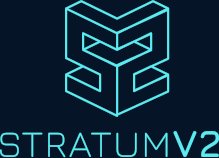
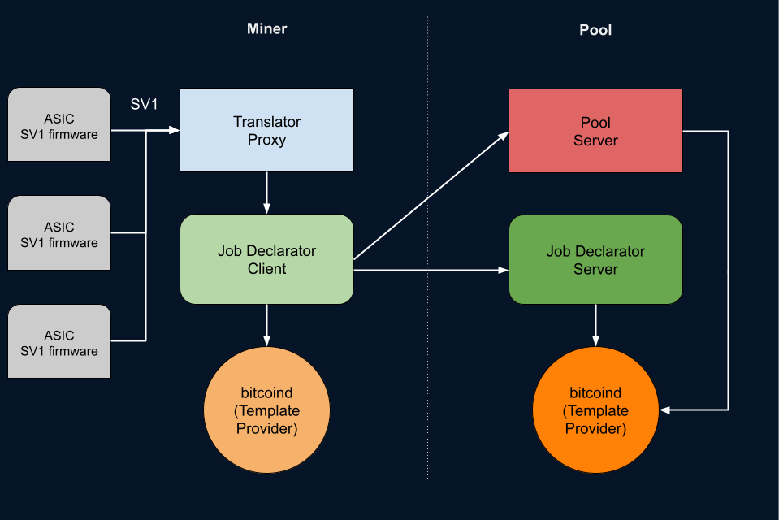

<style scoped>
h1 {
  text-align: center;
}
</style>



# A step towards mining decentralization.

---

Slides available at

http://185.130.45.51:8888/html/sv2-workshop.html

---

## Workshop support

Supported OSs:
- Linux (vanilla distros, if you're on an exotic distro, good luck!)
- MacOS

Non-supported OSs:
- Windows (you might still try, but we didn't test it!)

Supported archs:
- x86-64
- arm64

---

## Workshop software

We will be working with the following software:
1. Bitcoin Core v30 (natively).
2. `sv2-apps` repo (via Docker).
3. `cpuminer` (natively).

---

## Docker Setup

1. Install [Docker](https://docs.docker.com/engine/install/).
2. Configure Docker with the following minimum resource allocations:
    - CPU limit: 4
    - Memory limit: 8GB
    - Swap: 2GB
    - Virtual disk limit: 128 GB

---

## Stratum V2: Specs

Can be read at [`stratumprotocol.org/specification`](http://stratumprotocol.org/specification)

Can be improved at [`github.com/stratum-mining/sv2-spec`](http://github.com/stratum-mining/sv2-spec)

---

## SV2 Roles

One of the main conceptual entity in SV2 is the notion of **Roles**.

They are involved in data flow and can be labeled as downstream or upstream in relationship to eachother.

---

## Template Provider (TP)

(Usually) a Bitcoin Core node, responsible for creation of Block Templates.

Deployed on both Pool and Miner infrastructure.

---

## Pool

A Pool is where the hashrate produced by Mining Devices is consumed.

It is the most upstream role.

## Job Declarator Server (JDS)

Deployed on the Pool infrastructure.

It receives and manages the custom block templates (on behalf of the Pool) declared by Job Declarator Clients (JDCs).

---

## Job Declarator Client (JDC)

Deployed on Miner infrastructure.

It creates new mining jobs from the templates received by the Template Provider and declares them to the JDS.

It's also able to automatically fallback to backup Pools in case of custom jobs refused by JDS (which is Pool side) or to switch to Solo Mining as a solution of last-resort.

## Translator Proxy (tProxy)

Responsible for translating the communication between SV1 Mining Devices and an SV2 Pool or Proxy.

It enables legacy SV1-only firmware to interact with SV2-based mining infrastructure.

---

Miner runs a **JDC**, and Pool runs a **JDS**.

Transactions are chosen by the **Miner's Template Provider**.

Mining Devices have legacy SV1 compatible firmware, connected to a **Translator Proxy**.

---



---

# Hands On!

---

Split in pairs. One will be the pool, the other will be the miner.

Instructions available at http://185.130.45.51:8888/html/sv2-workshop.html

---

## Custom Signet

Which network should we do our workshop?

- `testnet3`? Well, Lopp broke it.
- `signet`? Well, we need the audience to be able to mine blocks.
- `testnet4`? Well, we want a controlled hashrate environment.

We will mine on a custom signet that does not require coinbase signatures. This way, the audience can deploy pools + hashers and emulate a confined hashrate environment.

---

## Connect to Workshop Wifi

Connect to this WiFi:
- SSID: `sv2-workshop`
- Password: `proofofwork`

---

## Download Bitcoin Core

Download v30 from https://bitcoincore.org/en/download/

Note: if you're on macOS, make sure you get the `.tar.gz`, and not `.zip`!

```
wget https://bitcoincore.org/bin/bitcoin-core-30.0/bitcoin-30.0-<arch>-<OS>.tar.gz
tar xvf bitcoin-30.0-<arch>-<OS>.tar.gz
```

---

## Configure Bitcoin Core

Edit the `bitcoin.conf` on the default path of your system:
- macOS: `/Users/<username>/Library/Application Support/Bitcoin/bitcoin.conf`
- linux: `/home/<username>/.bitcoin/bitcoin.conf`

```conf
[signet]
# OP_TRUE
signetchallenge=51
server=1
connect=185.130.45.51 # genesis node
rpcuser=username
rpcpassword=password
rpcbind=0.0.0.0
rpcallowip=0.0.0.0/0
```

---

## Start Bitcoin Core

```sh
./bitcoin-30.0/bin/bitcoin -m node -ipcbind=unix -signet
```

Wait for IBD, but you can still navigate the following slides while you wait.

---

## Navigate `mempool.space`

There's a `mempool.space` block explorer available at:

http://185.130.45.51:8080/

---

## Clone sv2-apps

```sh
git clone https://github.com/stratum-mining/sv2-apps -b v0.1.0
```

---

## Pool-only steps

Miners can jump to slide 26.

---

On a new terminal:

## Create wallet (Pool)

```
./bitcoin-30.0/bin/bitcoin-cli -signet createwallet sv2-workshop
```

## Generate address (Pool)

```
./bitcoin-30.0/bin/bitcoin-cli -signet getnewaddress sv2-workshop-address
```

---

Create a file called `docker_env` inside the `docker` directory of `sv2-apps` repository with the following contents:

```
# on linux, this is probably: /home/<username>/.bitcoin/signet/node.sock
# on macOS, this is probably: /Users/<username>/Library/Application Support/Bitcoin/signet/node.sock
BITCOIN_SOCKET_PATH=/absolute/path/to/your/node.sock

POOL_COINBASE_REWARD_SCRIPT=addr(your_wallet_address) # paste the address generated via bitcoin-cli inside the addr()
JDS_COINBASE_REWARD_SCRIPT=addr(your_wallet_address) # paste the address generated via bitcoin-cli inside the addr()

## no need to change these settings
POOL_SHARES_PER_MINUTE=6.0
POOL_SHARE_BATCH_SIZE=10
POOL_FEE_THRESHOLD=100
POOL_MIN_INTERVAL=5
POOL_SIGNATURE="Stratum V2 SRI Pool"
JDS_CORE_RPC_PORT=38332
JDS_CORE_RPC_USER=username
JDS_CORE_RPC_PASS=password
```

---

Launch pool apps (from `docker` directory):

```sh
docker compose --profile pool_apps --env-file docker_env up --build
```

---

## Miner-only steps

---

Ask for your **pool colleagues** for their IP in the `sv2-workshop` WiFi LAN.

---

<style scoped>
section {
  font-size: 20px;
}
pre {
  font-size: 14px;
}
</style>

Create a file called `docker_env` inside the `docker` directory of `sv2-apps` repository, with the following contents:

```
# on linux, this is probably: /home/<username>/.bitcoin/signet/node.sock
# on macOS, this is probably: /Users/<username>/Library/Application Support/Bitcoin/signet/node.sock
BITCOIN_SOCKET_PATH=/absolute/path/to/your/node.sock

JDC_SIGNATURE="your_miner_signature" # string you want to write into the coinbase
JDC_POOL_ADDRESS=X.Y.Z.W # IP address you took from a pool colleague
JDC_UPSTREAM_JDS_ADDRESS=X.Y.Z.W # IP address you took from a pool colleague

## no need to change these settings
JDC_POOL_PORT=34254
JDC_UPSTREAM_JDS_PORT=34264
JDC_SHARES_PER_MINUTE=6.0
JDC_SHARE_BATCH_SIZE=10
JDC_FEE_THRESHOLD=100
JDC_MIN_INTERVAL=5
JDC_UPSTREAM_AUTHORITY_PUBKEY=9auqWEzQDVyd2oe1JVGFLMLHZtCo2FFqZwtKA5gd9xbuEu7PH72
JDC_USER_IDENTITY=your_username_here
JDC_COINBASE_REWARD_SCRIPT=addr(tb1qr8xjkrx46yfsch7q2ts2g007haufq48n9pe6qc)
TPROXY_AGGREGATE_CHANNELS=true
TPROXY_MIN_INDIVIDUAL_MINER_HASHRATE=10_000_000.0
TPROXY_SHARES_PER_MINUTE=6.0
TPROXY_ENABLE_VARDIFF=true
TPROXY_UPSTREAM_ADDRESS=172.28.0.13
TPROXY_UPSTREAM_PORT=34265
TPROXY_UPSTREAM_AUTHORITY_PUBKEY=9auqWEzQDVyd2oe1JVGFLMLHZtCo2FFqZwtKA5gd9xbuEu7PH72
TPROXY_USER_IDENTITY=your_username_here
```

---

Launch miner apps (from `docker` directory):

```sh
docker compose --profile miner_apps --env-file docker_env up --build
```

---

## CPU miner

Download a release for your platform from:

https://github.com/stratum-mining/cpuminer/releases/tag/v2.5.1

---

## Start CPU mining

```sh
./minerd -a sha256d -o stratum+tcp://localhost:34255 -q -D -P -t 1
```

---


<br>
# Q&A 

---

# Thank you
